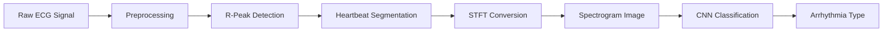
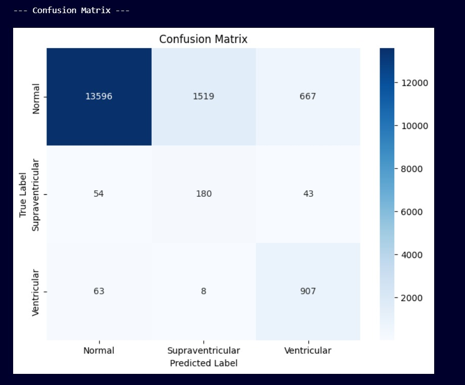
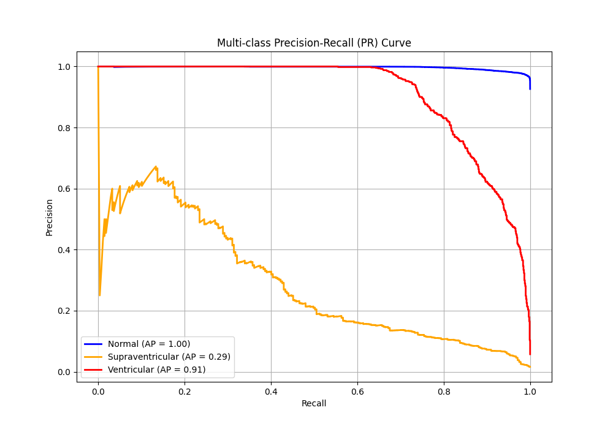
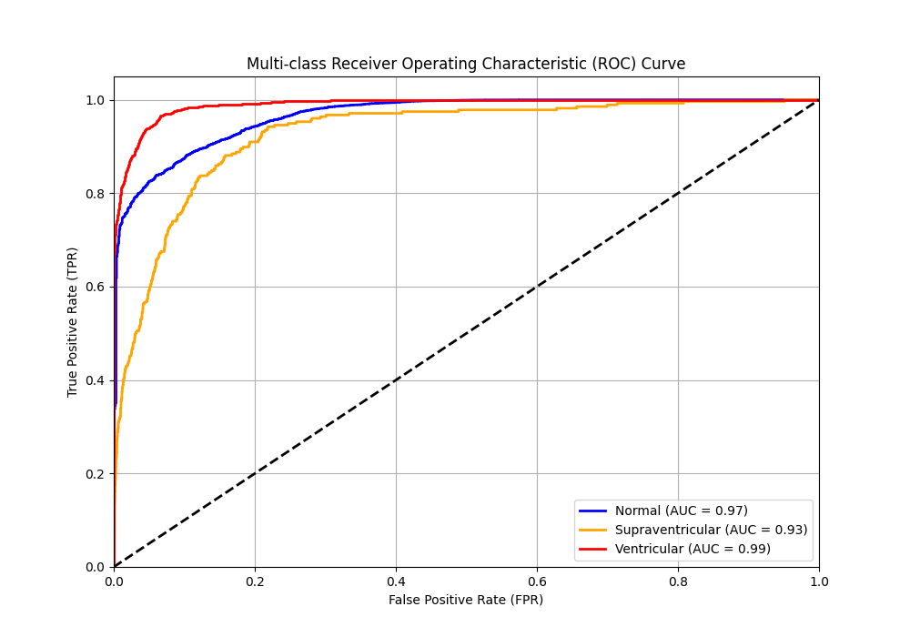

# 🫀 Spectrogram-Driven ECG Arrhythmia Classifier

<div align="center">


**Deep Learning-Based Classification Using Signal-to-Image Translation**

[Features](#-key-highlights) • [Installation](#-installation) • [Usage](#-usage) • [Results](#-results) • [Architecture](#-architecture)

</div>

---

## 📋 Overview

This project implements an **end-to-end ECG Arrhythmia Detection system** where raw 1D ECG signals are transformed into 2D spectrogram images and classified using a Convolutional Neural Network (CNN). By bridging traditional signal processing with modern deep learning, we achieve both high performance and clinical interpretability.

**Dataset:** MIT-BIH Arrhythmia Database (PhysioNet) — the gold standard for ECG research

---

## ✨ Key Highlights

- 🎯 **86.18% Test Accuracy** with proper patient-wise validation
- 🚨 **93% Recall for Ventricular Arrhythmia** (critical for clinical safety)
- 🔬 **Signal-to-Image Translation** using Short-Time Fourier Transform (STFT)
- 🧠 **Lightweight CNN Architecture** optimized for spectrogram classification
- 🔍 **Explainable AI** with Grad-CAM visualizations
- 📊 **Zero Data Leakage** through patient-wise train/validation/test splits

### Classification Classes

| Class | Description | Clinical Importance |
|-------|-------------|---------------------|
| 🟢 **Normal** | Regular sinus rhythm | Baseline health indicator |
| 🔴 **Ventricular** | Life-threatening arrhythmia | Requires immediate intervention |
| 🟡 **Supraventricular** | Upper chamber arrhythmia | Moderate clinical concern |

---

## 📂 Repository Structure

```
.
├── 📁 Pipeline/                    # Visual pipeline diagrams
│   └── signal_to_spectrogram_to_cnn.png
├── 📁 evaluation_plots/            # Performance visualizations
│   ├── confusion_matrix.png
│   ├── pr_curve.png
│   └── roc_curve.png
├── 📁 sample_spectrograms/         # Example spectrograms per class
│   ├── normal_sample.png
│   ├── ventricular_sample.png
│   └── supraventricular_sample.png
├── 📓 arrhythmia-detection3.ipynb  # Complete training pipeline
├── 📄 requirements.txt             # Python dependencies
└── 📖 README.md                    # This file
```

> **Note:** MIT-BIH dataset must be downloaded separately from PhysioNet (not included in repo)

---

## 🩺 Dataset Information

### MIT-BIH Arrhythmia Database

- 📡 **Sampling Rate:** 360 Hz
- 👨‍⚕️ **Annotation:** Beat-by-beat labeling by cardiologists
- 📊 **Beat Types:** Normal, Ventricular, Supraventricular, Fusion, and others
- 🎯 **Project Focus:** 3 primary classes (Normal, Ventricular, Supraventricular)

### Patient-Wise Split Strategy

To simulate real-world deployment and prevent data leakage:

| Split | Percentage | Purpose |
|-------|-----------|---------|
| **Train** | 70% | Model learning |
| **Validation** | 15% | Hyperparameter tuning |
| **Test** | 15% | Final evaluation on unseen patients |

---

## 🔄 Pipeline Architecture

<div align="center">



</div>

### 1️⃣ Signal Preprocessing

- **Bandpass Filtering:** 0.5 Hz – 40 Hz (removes baseline wander and noise)
- **R-Peak Detection:** Derivative + threshold + search window algorithm
- **Windowing:** 2-second heartbeat-centered segments
- **Normalization:** Z-score standardization
- **Labeling:** Automatic assignment from MIT-BIH annotations

### 2️⃣ Signal-to-Image Translation (STFT)

Each heartbeat undergoes transformation:

```python
ECG Segment → STFT → Magnitude → Log-scale → Frequency Crop (<45 Hz) → Resize (128×128) → PNG
```

**Why Spectrograms?**
- Reveals time-frequency patterns invisible in raw signals
- CNNs excel at 2D visual pattern recognition
- Captures physiologically relevant frequency bands

### 3️⃣ CNN Architecture

```
Input (128×128×3)
    ↓
Rescaling Layer
    ↓
[Conv2D (32) → ReLU → BatchNorm → MaxPool2D] ×1
    ↓
[Conv2D (64) → ReLU → BatchNorm → MaxPool2D] ×1
    ↓
[Conv2D (128) → ReLU → BatchNorm → MaxPool2D] ×1
    ↓
Flatten → Dense(128) → Dropout(0.5)
    ↓
Dense(3, softmax)
```

**Training Configuration:**
- Optimizer: Adam
- Loss: Categorical Crossentropy
- Batch Size: 32
- Early Stopping: Patience = 5 epochs
- Class Weighting: Handles imbalanced data

---

## 📊 Results

### Overall Performance

| Metric | Value |
|--------|-------|
| **Test Accuracy** | 86.18% |
| **Test Samples** | 17,037 |
| **Training Time** | ~2 hours (GPU) |

### Per-Class Metrics

| Class | Precision | Recall | F1-Score | ROC-AUC |
|-------|-----------|--------|----------|---------|
| 🟢 Normal | 0.99 | 0.86 | 0.92 | 0.97 |
| 🟡 Supraventricular | 0.11 | 0.65 | 0.18 | 0.93 |
| 🔴 Ventricular | 0.56 | **0.93** | 0.70 | **0.99** |

> **Clinical Highlight:** 93% Ventricular recall ensures critical cases are not missed

### Visualizations

<table>
<tr>
<td width="33%">

**Confusion Matrix**


</td>
<td width="33%">

**Precision-Recall Curve**


</td>
<td width="33%">

**ROC Curve**


</td>
</tr>
</table>

---

## 🔍 Explainability (Grad-CAM)

Grad-CAM heatmaps reveal what the CNN focuses on:

| Class | CNN Focus | Clinical Correlation |
|-------|-----------|---------------------|
| 🟢 Normal | Smooth, low-frequency zones | Regular QRS complex |
| 🔴 Ventricular | Irregular wideband energy bursts | Ectopic beats, wide QRS |
| 🟡 Supraventricular | Diffuse activation patterns | Subtle P-wave abnormalities |

This transparency ensures **clinically interpretable predictions**.

---

## 🚀 Installation

### Prerequisites

- Python 3.8+
- CUDA-capable GPU (recommended)
- 8GB+ RAM

### Step 1: Clone Repository

```bash
git clone https://github.com/yourusername/ecg-arrhythmia-classifier.git
cd ecg-arrhythmia-classifier
```

### Step 2: Install Dependencies

```bash
pip install -r requirements.txt
```

<details>
<summary>View Requirements</summary>

```
tensorflow>=2.10.0
numpy>=1.21.0
pandas>=1.3.0
matplotlib>=3.4.0
seaborn>=0.11.0
scikit-learn>=1.0.0
librosa>=0.9.0
opencv-python>=4.5.0
wfdb>=3.4.0
```

</details>

### Step 3: Download MIT-BIH Dataset

1. Visit [PhysioNet MIT-BIH Database](https://physionet.org/content/mitdb/1.0.0/)
2. Download all `.dat`, `.hea`, and `.atr` files
3. Place in: `dataset/mit-bih/`

---

## 💻 Usage

### Training & Evaluation

```bash
jupyter notebook arrhythmia-detection3.ipynb
```

The notebook walks through:
1. ✅ Data loading and exploration
2. ✅ Signal preprocessing
3. ✅ Spectrogram generation
4. ✅ CNN training
5. ✅ Model evaluation
6. ✅ Grad-CAM visualization

### Quick Inference (Coming Soon)

```python
from model import predict_arrhythmia

result = predict_arrhythmia('path/to/ecg_signal.csv')
print(f"Prediction: {result['class']} (Confidence: {result['confidence']:.2%})")
```

---

## 🛠️ Tech Stack

<div align="center">

| Category | Technologies |
|----------|-------------|
| **Deep Learning** |   |
| **Signal Processing** |   |
| **Visualization** |   |
| **Computer Vision** |  |
| **ML Tools** |  |

</div>

---

## 🎯 Future Enhancements

- [ ] Real-time ECG monitoring dashboard
- [ ] Multi-lead ECG support (12-lead standard)
- [ ] Model deployment via REST API
- [ ] Mobile app integration
- [ ] Transfer learning to other biosignals (EEG, EMG)
- [ ] Attention mechanisms for better interpretability
- [ ] Edge device optimization (TensorFlow Lite)

---

## 📚 References

1. [MIT-BIH Arrhythmia Database - PhysioNet](https://physionet.org/content/mitdb/1.0.0/)
2. [TensorFlow Documentation](https://www.tensorflow.org/)
3. [Librosa Signal Processing](https://librosa.org/)
4. Relevant Papers:
   - Hannun et al. "Cardiologist-level arrhythmia detection" (Nature Medicine, 2019)
   - Rajpurkar et al. "ECG deep learning for cardiologist-level detection"

---

## 📄 License

This project is licensed under the MIT License - see the [LICENSE](LICENSE) file for details.

---

## 🤝 Contributing

Contributions are welcome! Please follow these steps:

1. Fork the repository
2. Create a feature branch (`git checkout -b feature/AmazingFeature`)
3. Commit changes (`git commit -m 'Add AmazingFeature'`)
4. Push to branch (`git push origin feature/AmazingFeature`)
5. Open a Pull Request

---

## 👥 Authors

**Your Name**
- GitHub: [@ad8ya089](https://github.com/ad8ya089)
- LinkedIn: [Aditya Prakash]((https://www.linkedin.com/in/aditya-prakash-4161411bb/))
- Email: adityaprakash240305@gmail.com

---

## ⭐ Acknowledgments

- PhysioNet for providing the MIT-BIH Arrhythmia Database
- TensorFlow and Keras teams for excellent deep learning frameworks
- The open-source community for inspiration and support

---

<div align="center">

**If you find this project useful, please consider giving it a ⭐!**

Made with ❤️ and lots of ☕

</div>
